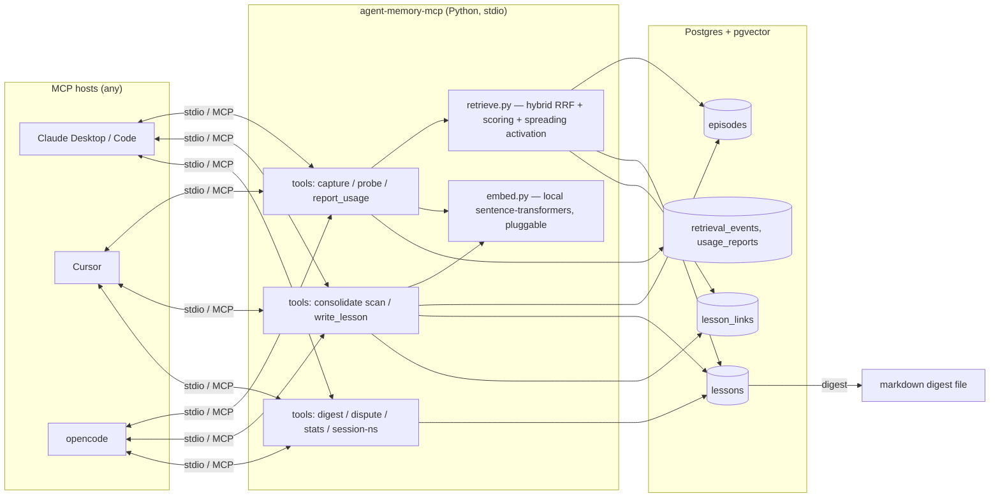

# Agent Memory — MCP Memory Server

**Status:** Draft v0.3 — implementation-synced · **Date:** 2026-09-18 · **Implementation:** Python · **Interface:** MCP server (stdio)

**v0.2 → v0.3:** session-scoped namespace + clientInfo default; screening scope; implementation-sync details below.

---

## 1. Problem

LLM agents are session-amnesiac. Within a conversation an agent adapts; when it ends, every lesson
evaporates. The next session re-makes the same confident wrong assumption, misreads the same config,
trusts the same flaky test. Notebooks and instruction files (AGENTS.md, vaults) are voluntary
prosthetics: they only record what a past agent *noticed* being wrong, which is exactly the blind
spot — and they store **conclusions**, whose compression discards the context that makes lessons
transfer correctly.

Two failure modes dominate:

1. **Lessons without context.** "Don't use approach X" fails to transfer to a superficially
   different but structurally identical situation, and wrongly transfers to a superficially similar
   but causally different one.
2. **Voluntary recall.** Agents don't query memory precisely when it matters — at the decision
   point where they don't yet suspect they're in a relevant situation.

## 2. Goal

A persistent memory substrate, exposed as an MCP tool server, usable by any MCP host (Claude
Desktop, Cursor, opencode, Claude Code, …) regardless of project. Postgres + pgvector backend.
Human-auditable. Cold-start interpretable; a learned ranker must be *earned* from feedback data.

**Non-goals (v0/v1):** multi-user tenancy, learned retrieval ranking, cross-agent shared memory,
embedding-model auto-upgrades, episode archival tiering.

---

## 3. Design Principles

These are commitments, not suggestions. Every later decision traces to one of them.

| # | Principle | Consequence |
|---|-----------|-------------|
| P1 | **Episodes are immutable truth; lessons are derived views.** | Append-only `episodes` table. Lessons cite episodes via `lesson_evidence` edges (support/contradict/refine) — FK-enforced, one mechanism for corroboration and contradiction. Provenance is never destroyed. |
| P2 | **Store the burn, not the rule.** | Primary record = goal, expectation, action, outcome, *surprise*. Gist ("because", "holds when") is distilled later and stays revisable. |
| P3 | **Ranking weights learn from usage; truth weights move only on evidence.** | `usefulness`/access stats respond to retrieval outcomes. `confidence` responds *only* to corroboration/contradiction — never to time or clicks. |
| P4 | **Mood is context, never a retrieval feature.** | `state_at_encoding` is JSONB, excluded from the embedded text and from similarity matching. (Guard against mood-congruent retrieval → rumination spirals.) |
| P5 | **Freshness decays ranking, never validity — and no-usage is not no-relevance.** | Rare-but-critical lessons stay valid though unretrieved; usage recency is a *boost-only* term; only contradiction lowers confidence. Rarity ≠ staleness, and absence of use is not evidence of irrelevance. |
| P6 | **Human-readable is a view, not the storage format.** | Markdown digest generated from the DB (Obsidian-friendly). The human read is the audit pass over consolidation. |
| P7 | **The query is the agent's current intent, not keywords.** | `memory_probe(goal, approach)` — retrieval keyed on what the agent is *about to do*. |
| P8 | **The server is LLM-free; the host model does the thinking.** | Clustering and storage in the server; summarization/drafting happens in the host agent via tool results. No API keys, no cost, host-agnostic. |
| P9 | **Contradictions coexist; they don't overwrite.** | Conflicting episodes become lessons linked `contradicts`, each with split confidence. Resolution happens when new evidence arrives. |

---

## 4. Architecture



- **Transport:** stdio (MCP default). One server process per host; all processes share one Postgres.
- **Embeddings:** local `sentence-transformers` by default (`all-MiniLM-L6-v2`, 384 dims). Pluggable
  via an `Embedder` protocol; dimension is config, schema is generated to match.
- **Stack:** `mcp` official SDK ≥ 2.2.0 (`MCPServer`, `@mcp.tool()`, `mcp.run()` → stdio;
  middleware seam for clientInfo), `psycopg[binary]`
  v3 + `pgvector`, `pytest` + testcontainers-postgres.

---

## 5. Data Model

```sql
CREATE TABLE episodes (
  id               BIGSERIAL PRIMARY KEY,
  created_at       TIMESTAMPTZ NOT NULL DEFAULT now(),
  namespace        TEXT NOT NULL,               -- agent × project scope (see §11)
  goal             TEXT,                        -- what I was trying to do
  expectation      TEXT,                        -- what I believed would happen
  action           TEXT,                        -- what I did
  outcome          TEXT,                        -- what actually happened
  surprise         REAL NOT NULL DEFAULT 0.0,   -- 0..1 prediction-error magnitude (P2)
  state_at_encoding JSONB,                      -- mood/context signals; stored, NEVER matched (P4)
  tags             TEXT[] NOT NULL DEFAULT '{}',
  raw_text         TEXT NOT NULL,               -- fallback / free-form capture
  embedding        vector(384),                 -- embedded from goal+expectation+action+outcome ONLY
  search_tsv       tsvector GENERATED ALWAYS AS
                   (to_tsvector('english', coalesce(goal,'') || ' ' || coalesce(expectation,'')
                     || ' ' || coalesce(action,'') || ' ' || coalesce(outcome,''))) STORED,
  access_count     INT NOT NULL DEFAULT 0,
  last_accessed    TIMESTAMPTZ,                 -- updated only on reported usage (P3)
);
CREATE INDEX ON episodes USING gin (search_tsv);
CREATE INDEX ON episodes USING hnsw (embedding vector_cosine_ops);
CREATE INDEX ON episodes (namespace, created_at DESC);

CREATE TABLE lessons (
  id               BIGSERIAL PRIMARY KEY,
  created_at       TIMESTAMPTZ NOT NULL DEFAULT now(),
  updated_at       TIMESTAMPTZ NOT NULL DEFAULT now(),
  namespace        TEXT NOT NULL,
  claim            TEXT NOT NULL,               -- the rule
  because          TEXT NOT NULL,               -- causal gist — the transferable part (P2)
  holds_when       TEXT,                        -- deliberately fuzzy boundary conditions
  fails_when       TEXT,
  confidence       REAL NOT NULL DEFAULT 0.5,   -- evidence-driven only (P3, P5)
  last_evidence_at TIMESTAMPTZ NOT NULL DEFAULT now(),  -- denormalized: max(created_at) over lesson_evidence episodes; evidence clock (world drift), never moved by usage
  embedding        vector(384),                 -- claim + because + holds_when
  search_tsv       tsvector GENERATED ALWAYS AS
                   (to_tsvector('english', claim || ' ' || because
                     || ' ' || coalesce(holds_when,''))) STORED,
  access_count     INT NOT NULL DEFAULT 0,
  usefulness       REAL NOT NULL DEFAULT 0.0,   -- running (helped − harmed) signal
  last_accessed    TIMESTAMPTZ,
  disputed         BOOLEAN NOT NULL DEFAULT FALSE,
  -- promotion metadata (global copies only; NULL for originals — §11)
  promoted_from_lesson_id BIGINT REFERENCES lessons(id),
  promotion_reason TEXT,                        -- why the human graduated this lesson
  promoted_at      TIMESTAMPTZ,
  promotion_seed_confidence REAL,               -- confidence inherited at promotion; frozen for audit
  promotion_status TEXT NOT NULL DEFAULT 'active' CHECK (promotion_status IN ('active','demoted')),
  demoted_at       TIMESTAMPTZ,                 -- tombstone, never a delete
  demotion_reason  TEXT
);
CREATE INDEX ON lessons (namespace, promotion_status)
  WHERE promoted_from_lesson_id IS NOT NULL;    -- global retrieval union filters to active
CREATE INDEX ON lessons USING gin (search_tsv);
CREATE INDEX ON lessons USING hnsw (embedding vector_cosine_ops);

CREATE TABLE lesson_evidence (                  -- relational provenance (P1): evidence is a first-class edge
  lesson_id        BIGINT NOT NULL REFERENCES lessons(id) ON DELETE CASCADE,
  episode_id       BIGINT NOT NULL REFERENCES episodes(id),
  relation         TEXT NOT NULL CHECK (relation IN ('support','contradict','refine')),
  reason           TEXT,
  added_at         TIMESTAMPTZ NOT NULL DEFAULT now(),
  PRIMARY KEY (lesson_id, episode_id)          -- one AGGREGATE verdict per pair — see note below
);
CREATE INDEX ON lesson_evidence (episode_id);   -- reverse traversal: which lessons cite this episode (dispute tracing)

CREATE TABLE lesson_links (                     -- lesson↔lesson graph: spreading activation + P9 contradiction links
                                               -- (evidence edges above are lesson↔episode — two graphs, two jobs)
  lesson_id        BIGINT NOT NULL REFERENCES lessons(id),
  related_lesson_id BIGINT NOT NULL REFERENCES lessons(id),
  kind             TEXT NOT NULL CHECK (kind IN ('similar','contradicts','refines')),
  weight           REAL NOT NULL DEFAULT 0.5,   -- cosine similarity at write time
  created_at       TIMESTAMPTZ NOT NULL DEFAULT now(),
  PRIMARY KEY (lesson_id, related_lesson_id, kind)
);

CREATE TABLE retrieval_events (                 -- exposure log: written by probe/search at query time
  id               BIGSERIAL PRIMARY KEY,
  ts               TIMESTAMPTZ NOT NULL DEFAULT now(),
  namespace        TEXT NOT NULL,
  tool             TEXT NOT NULL CHECK (tool IN ('probe','search')),
  query_context    TEXT NOT NULL,               -- goal+approach as sent
  returned_ids     BIGINT[] NOT NULL            -- what was SHOWN; record stats untouched (P3)
);

CREATE TABLE usage_reports (                    -- outcomes: only what the caller explicitly reports
  id               BIGSERIAL PRIMARY KEY,
  retrieval_event_id BIGINT NOT NULL REFERENCES retrieval_events(id),
  record_id        BIGINT NOT NULL,
  record_type      TEXT NOT NULL CHECK (record_type IN ('episode','lesson')),
  outcome          TEXT NOT NULL CHECK (outcome IN ('used','helped','harmed','ignored')),
  reported_at      TIMESTAMPTZ NOT NULL DEFAULT now(),
  UNIQUE (retrieval_event_id, record_id)        -- one verdict per shown record
);
```

**Why two tables and not one:** this is the episodic/semantic split. Episodes never change (you
can't un-burn yourself). Lessons are re-derivable interpretations that go stale. When a lesson smells
wrong, the evidence graph lets you trace it to the episodes that spawned it and check whether they
actually support it — the audit trail (P1, P6).

Provenance is relational, not an array, for three reasons: FKs guarantee every citation resolves
(an array of IDs can dangle silently); reverse lookups ("which lessons did this episode feed?") are
indexed instead of `ANY()` array scans; and corroboration, contradiction, and refinement become the
*same mechanism* — one edge type, different `relation` — rather than a growing array plus bolt-on
link semantics. `last_evidence_at` stays a denormalized column for retrieval speed but is derived
from `lesson_evidence` and refreshable from it.

**Consolidation is derived, never stored.** An episode is "consolidated" iff any `lesson_evidence`
edge cites it — there is no flag to set, so nothing can exclude an episode from future
consideration. Episodes are **reusable across lessons by construction**: the same
Docker-behind-a-reverse-proxy episode can support both the specific lesson and the more general
"transport-level success ≠ application readiness" abstraction. Multi-cited episodes (≥2 lessons)
are cross-cutting structure — surfaced by stats as generalization candidates — not double-counting:
each lesson's confidence prices its own claim's evidence, independently. The symmetry runs one way:
*episodes* may be reused; *lessons* may not — near-duplicate claims are rejected at write (§8).

**`relation` is an aggregate verdict.** One edge says what this episode, taken whole, does to this
claim. An episode that supports a lesson's core while contradicting one boundary condition yields
the single dominant verdict (or `refine`). Finer-grained, per-component evidence semantics are a
documented non-goal for v1 — if ever needed, they *extend* the edge with a component qualifier
rather than change its meaning.

---

## 6. Weights — what moves them, what they affect

| Weight | Lives on | Set / moved by | Affects | Never affects |
|--------|----------|----------------|---------|---------------|
| `surprise` | episode | Capture time (caller-rated prediction error) | Retrieval salience; consolidation priority | Nothing else — immutable |
| `confidence` | lesson | Seeded server-side at write (diversity formula, §8); corroboration **+0.1 × novelty** (novelty: 1.0 for a new occasion/context, ~0.3 for a near-duplicate of existing support), contradiction **−0.2** flat; cap 0.95, floor 0.05 | Retrieval salience; digest flags | Never decayed by time (P5); never caller-set |
| `last_evidence_at` (lessons; episodes use immutable `created_at`) | both | Evidence-edge writes (`write_lesson` / `corroborate` / `contradict`): max `created_at` over cited episodes; derivable from `lesson_evidence` | Evidence-freshness term (world drift); staleness flag | Never moved by usage; never touches `confidence` |
| `last_accessed` / `access_count` | both | `memory_report_usage` only — exposure ≠ usage | Usage-freshness term (**boost-only**, see §7) | Validity; evidence-freshness; staleness flag |
| `usefulness` | lesson | Running helped/harmed tally from usage reports | Retrieval salience (weak) | `confidence` (P3) |
| `state_at_encoding` | episode | Capture time | Display/context in results | **Never retrieval similarity** (P4) |

Contradiction outweighs corroboration 2:1 — disconfirming evidence is stronger evidence.

---

## 7. Retrieval Pipeline

**Query construction (P7):** caller supplies `current_goal` and optional `approach`; the server
embeds `goal + ' ' + approach` as the query vector and uses the same text for keyword search. The
agent's *current intent* is the query — not the user's words.

**Hybrid search:** two independent rankings over the namespace —
1. keyword: `ts_rank` on `search_tsv` via websearch-to_tsquery,
2. vector: cosine (`<=>`) via HNSW,

merged with **Reciprocal Rank Fusion**: `rrf(r) = Σ 1 / (60 + rank_i(r))`. Keyword asks *"has this
happened"*; similarity asks *"has anything shaped like this happened"* (P7's dual).

**Scoring (v1 hand-weighted, env-tunable — P8's cold start).** *Normalization contract:* every
feature is scaled to [0, 1] **before** the weighted sum, so the weights are true mix shares within
a query's candidate set. Raw RRF violates this by construction — dual-channel rank-1 is `2/61 ≈
0.033`, so an un-normalized 0.55 "relevance" weight actually contributes ~0.018, an order of
magnitude under salience. The weights must mean what they say.

```python
rel_norm         = rrf / max(rrf over candidate set)       # relative — for mixing
vector_strength  = (cosine − SIM_FLOOR) / (1 − SIM_FLOOR)  # underlying channel strength, 0..1
keyword_strength = min(1, ts_rank / TS_RANK_SAT)           # ts_rank against a saturation ceiling
match_strength   = max(vector_strength, keyword_strength)  # absolute 0..1 — for gating & shaping
salience_norm  = surprise (episode) | confidence (lesson)   # already 0..1
env_fresh      = exp(-hours_since(evidence_ts) / TAU_ENV)   # evidence_ts = last_evidence_at | created_at
use_fresh      = exp(-hours_since(last_accessed) / TAU_USE) if ever_used else 0.0  # BOOST-ONLY
activation     = clip(edge.weight * parent_score_norm)      # one-hop spread, below

score = ( W_REL    * rel_norm        # 0.45 — hybrid relevance
        + W_SAL    * salience_norm   # 0.20 — episode: surprise; lesson: confidence
        + W_ENV    * env_fresh       # 0.15 — world drift, evidence clock (TAU_ENV = 4320h)
        + W_USE    * use_fresh       # 0.10 — recent usefulness (TAU_USE = 720h), boost-only
        + W_SPREAD * activation )    # 0.10 — neighbor boost
```

Two guards come with the relative normalization:

- **Gate on the absolute.** The candidate pool requires `ts_rank > 0` OR cosine > `SIM_FLOOR`
  (default 0.25), and `match_strength` — computed from the underlying channel strengths, *not*
  from RRF — is returned with every result. RRF is rank-based: a vector hit barely above the floor
  can still rank #1 in a thin field, and deriving "absolute" strength from it launders that
  artifact into a deceptively strong score. Division of labor: `rel_norm` answers *how well does
  this rank within this candidate set*; `match_strength` answers *how strong was the actual
  match*. Max-normalization still crowns the best of a thin pool at 1.0 — the channel-derived
  value is what lets the caller tell "weak field" from "strong hit."
- **Usage freshness is boost-only.** `use_fresh` adds score when a record helped recently and
  contributes exactly zero when never used. "Hasn't been useful lately" must not read as "less
  likely relevant now" — that punishes rarity as if it were staleness (P5). The drift signal is
  carried by `env_fresh` alone, on the evidence clock: a lesson's world can only age via its
  supporting episodes, and only new evidence rejuvenates it (corroboration refreshes
  `last_evidence_at` — reconsolidation through evidence, same as confidence).

**Spreading activation:** retrieve top-K (K=12) → collect one-hop `lesson_links` from the top lessons
→ neighbors gain `edge.weight × parent_score_normalized` as `activation` → re-rank → return final
K=8. One recollection drags its neighborhood up (Collins & Loftus, 1975). Non-neural, debuggable,
does most of what a learned ranker would — before it has data.

**Result shaping:** every hit returns provenance (evidence edges — relation, reason, short episode
excerpts), `confidence`, `match_strength`, and a staleness note when evidence is old but salience is high
(`env_fresh < 0.2` & salience high → "rare-critical, possibly stale environment" — an
evidence-clock judgment, not a usage one).
Memories arrive as **evidence with provenance, not commands** — the calling agent discounts, not
obeys.

Access stats are **not** updated by retrieval — only by reported usage (P3). But retrieval *is*
logged: every probe/search writes a `retrieval_events` row (exposure), and outcomes attach later as
`usage_reports` keyed to that event. The state vocabulary is **shown → used → helped/harmed**, plus
explicit **ignored** (seen and deliberately passed over). Absence of a report is *no verdict* —
never "ignored." Not-selected is ranking data, not a value judgment, and conflating the two poisons
exactly the training signal the v3 ranker needs: what the agent saw but passed over, distinct from
what it never reported on.

---

## 8. Consolidation Protocol (agent-in-the-loop, server LLM-free — P8)

The compression pass that turns episodes into lessons. Triggered on demand (`memory_consolidate_scan`)
or by cron via the CLI entrypoint.

1. **Scan:** server selects age-eligible episodes (`created_at < now() - interval '1 hour'` — let
   the dust settle), clusters by embedding cosine > 0.82, returns clusters with full episode text.
   `pool='fresh'` (default) limits to episodes with no `lesson_evidence` edges — the raw backlog;
   `pool='all'` includes already-cited episodes, for abstraction passes where a cited episode joins
   a *new*, more general lesson (the Docker-specific / transport-readiness pair above).
2. **Draft:** the *host agent* reads the clusters and drafts lessons — claim, because, holds_when,
   fails_when — citing which episodes support them. Where episodes within a cluster conflict, it
   writes **two** lessons (P9) and names the contradiction.
3. **Write:** `memory_write_lesson` stores the lesson and one `support`/`refine` evidence edge per
   cited episode — the edges *are* the consolidation, no flag to set — and guards duplicates on
   two thresholds: the claim alone is embedded, and a claim cosine above `DUP_CLAIM_COS` to an
   existing lesson in the namespace is rejected as a duplicate (episodes may be reused, lessons
   may not) unless the twin sits in the `replaces_disputed` lineage — re-derivations share their
   claim by design, so supersession is the sanctioned verbatim path. The composite
   `claim + because + holds_when` embedding drives retrieval and `similar` links (cosine > 0.75)
   only: identical rationale under a different claim links, never rejects. The **server**
   seeds confidence — never the caller (P3) — via an evidence-diversity formula:

   ```
   incidents  = support episodes after near-duplicate collapse
                (same namespace, cosine > 0.95, within 24h → one incident)
   diversity  = min(1, distinct_occasions / 4)   -- occasions: distinct days (v1 proxy;
                                                  -- later: time/project/context distance)
   seed       = 0.35                             -- base
              + min(0.15, 0.05 × (incidents − 1)) -- repeats pay a capped rate
              + 0.20 × diversity                 -- spread across situations pays full rate
   ```

   Raw count is deliberately distrusted: five episodes in one cluster can be five echoes of a
   single incident, which is far weaker evidence than independent confirmations across different
   situations. Repeats still help — capped. Diversity is what pays. Max seed ≈ 0.70; only novel
   corroboration (novelty-scaled, §6) pushes past it toward the 0.95 cap.
4. **Evidence moves:** `memory_corroborate` / `memory_contradict` insert evidence edges (`support` /
   `contradict`, with `reason`); confidence moves per §6; lesson↔lesson `contradicts` links are
   written only for the P9 two-lesson case.

**Reconsolidation:** a disputed lesson (see §10) is re-derived on the next scan — sources are still
there, because episodes are immutable (P1). Memory that never updates isn't wisdom; memory that
overwrites silently isn't memory.

---

## 9. MCP Tool Surface

Namespace-resolving tools (`memory_capture_episode`, `memory_probe`, `memory_search`,
`memory_consolidate_scan`, `memory_write_lesson`, `memory_stats`, `memory_digest`) resolve target
namespace via precedence: tool param > session-set > explicit settings (`MEMORY_NAMESPACE`,
`--namespace`, or any pydantic Settings source) > clientInfo-derived default. ID-addressed tools
(`memory_corroborate`, `memory_contradict`, `memory_promote`, `memory_demote`, `memory_dispute`,
`memory_report_usage`) list `namespace` for signature uniformity only; the supplied IDs alone scope
the mutation.

| Tool | When the agent calls it | Signature (abridged) |
|------|------------------------|----------------------|
| `memory_capture_episode` | At the moment of surprise — prediction error, correction, unexpected outcome | `(goal, expectation, action, outcome, surprise: float, state_at_encoding?: dict, tags?: list, raw_text?: str) → id` |
| `memory_probe` | **Before any non-trivial action** — the involuntary-recall convention (P7) | `(current_goal, approach?, k=8) → ranked episodes+lessons w/ provenance, confidence, staleness notes, retrieval_event_id` |
| `memory_search` | Explicit recall ("what do we know about X") | `(query, k) → same shape as probe` |
| `memory_report_usage` | After acting on probe results | `(retrieval_event_id, results: [{id, outcome: 'used'\|'helped'\|'harmed'\|'ignored'}]) → writes usage_reports; updates access/usefulness on used records only` |
| `memory_consolidate_scan` | Periodically / end of session; abstraction passes | `(pool: 'fresh'\|'all' = 'fresh', min_cluster_size=2) → clusters (fresh = never-cited backlog; all = includes cited episodes for generalization)` |
| `memory_write_lesson` | After drafting from a cluster | `(claim, because, holds_when?, fails_when?, evidence: [{episode_id, relation: 'support'\|'refine'\|'contradict', reason?}], contradicts?: lesson_id) → lesson_id` |
| `memory_corroborate` / `memory_contradict` | When new evidence bears on a lesson — thin wrappers over evidence-edge writes | `(lesson_id, episode_id, reason?) → inserts a support / contradict edge, moves confidence, refreshes last_evidence_at` |
| `memory_digest` | Human audit pass | `() → {path, flagged: [...]}` — markdown digest written to disk |
| `memory_dispute` | Human flags a wrong lesson | `(lesson_id, reason) → pins to digest top, forces re-derivation next scan` |
| `memory_promote` | Human graduates a broadly useful lesson to `global` — manual-only | `(lesson_id, target_namespace='global', reason) → copies the lesson cross-namespace with `promoted_from` provenance; original preserved (§11)` |
| `memory_demote` | Human retires a global promotion | `(lesson_id, reason) → tombstones the copy (`promotion_status='demoted'` + reason); never deletes; original untouched |
| `memory_stats` | Curiosity / health check | counts, backlog, popular-but-shaky, rare-critical-stale, cross-cutting (episodes cited by ≥2 lessons) lists |
| `memory_set_namespace` | At session start when project scoping should override the configured or auto-derived default | `(namespace: str) → {namespace}` — validates non-empty input and rejects `global` (promotion-only); stored for this process only (one stdio client per process), never persisted; resolution precedence is tool param > session-set > explicit settings (`MEMORY_NAMESPACE`, `--namespace`, or any pydantic Settings source) > `<sanitized clientInfo name>@local`, with `default@local` as fallback, and clientInfo derivation applies only while `MEMORY_NAMESPACE` remains at its default |

**The involuntary-retrieval convention:** MCP cannot force a host to call tools. We make `memory_probe`
cheap and document the discipline ("probe before non-trivial actions"); hosts that support system
prompts can wire it as standing instruction. This is the honest limit of P7 under the protocol.

---

## 10. Human Audit Layer (P6)

`memory_digest()` renders the namespace to `~/.agent-memory/digest/<namespace>-<date>.md`
(Obsidian-friendly: wikilinks, frontmatter), ordered by what needs eyes:

1. **Disputed** lessons (pinned, with reason and source excerpts),
2. **Recently contradicted** (confidence dropped since last digest),
3. **Popular-but-shaky** (confidence < 0.3, access_count > 5),
4. **Rare-critical-stale** (high salience, very low `env_fresh` — old evidence) — the "environment drifted?" check,
5. **Recently demoted promotions** (tombstoned global copies, with reason — the historical-behavior record),
6. Unconsolidated backlog stats + a plain listing of lessons with confidence.

The vault becomes the *view* — human reads the projection, agent reads the base. When the human spots
a false memory the compressor wrote, `memory_dispute` forces re-derivation from intact provenance.

---

## 11. Scoping & Security

- **Namespace** defaults to `<sanitized clientInfo name>@local` (or `default@local` without usable
  clientInfo) when `MEMORY_NAMESPACE` is left at its default. Resolution precedence is per-tool
  `namespace` > session-set > explicit settings (`MEMORY_NAMESPACE`, `--namespace`, or any pydantic
  Settings source) > clientInfo-derived default. Suggested project override:
  `<agent>@<project-path-hash>`. `memory_set_namespace` sets the session tier for the process
  lifetime. With per-project namespaces (override or `memory_set_namespace`), projects are
  isolated; the zero-config clientInfo default scopes by agent identity (`<client>@local`) shared
  across that agent's projects — cross-project isolation requires the project pinning documented in
  the README; same agent+project across hosts converges.
- **Global namespace — manual promotion only.** `memory_promote` copies a lesson into namespace
  `global` with `promoted_from_lesson_id` provenance and the human's `reason`; the original project
  lesson stays where it is (copy, never move), with `promotion_reason`, `promoted_at`, and
  `promotion_seed_confidence` frozen at graduation — the audit answer to "why was this global, and
  what did it inherit at that moment?" Retrieval unions `(namespace, 'global')`, filtered to
  `promotion_status='active'`. No automatic graduation exists, by design: one project producing a
  convincing-looking pattern is exactly how global memory gets contaminated. The promoted copy's
  confidence evolves *independently*, from cross-project corroboration — global trust must be earned
  globally. Promotion enforces the target namespace's claim-identity bar (a claim already graduated
  cannot be duplicated; corroborate the existing lesson instead) and heals a missing source claim
  embedding at copy time. **Demotion is a tombstone, never a delete**: `promotion_status='demoted'` + `demoted_at`
  + `demotion_reason`, and the record stays queryable — months later, "why did the agent trust X in
  March?" must be answerable from the data, not reconstructed from its absence. The original
  project lesson is untouched throughout.
- **No secrets** — a best-effort regex screen rejects obvious token/key patterns at capture across
  text fields (`goal`, `expectation`, `action`, `outcome`, `raw_text`, `tags`) and in the reason
  fields of dispute, demote, promote, write-lesson evidence, corroborate, and contradict.
  `state_at_encoding` (arbitrary JSON context, stored for audit, never embedded or matched per P4)
  is screened recursively alongside the six text fields: every string value in the JSON, at any
  depth of dict/list nesting, is checked against the same pattern list, while non-string scalars
  pass through unchecked. A defense-in-depth scan rejects the rendered digest before it reaches
  `DIGEST_DIR`. Lesson body fields (`claim`, `because`, `holds_when`, `fails_when`) are
  deliberately unscreened because they derive from screened episodes and host authorship.
- **Local-first:** default embedder is local; no data leaves the machine. Remote embedders are opt-in.
- **Trust boundary:** lessons are agent-authored claims about the world. Hosts should treat probe
  results as advisory context, never as instructions (prompt-injection surface considered; digest
  review is the mitigation backstop).

## 12. Repository Layout

```
agent-memory-mcp/
  pyproject.toml                 # uv-compatible; deps: mcp, psycopg[binary], pgvector, sentence-transformers
  docker-compose.yml             # dev postgres w/ pgvector
  src/agent_memory/
    server.py                    # MCPServer app, tool definitions, run() entrypoint
    config.py                    # env: DATABASE_URL, MEMORY_NAMESPACE, EMBED_MODEL, weight overrides, TAU_ENV/TAU_USE, SIM_FLOOR, TS_RANK_SAT
    db.py                        # pool, migrations runner
    embed.py                     # Embedder protocol; LocalST default; DeterministicFake for tests
    retrieve.py                  # hybrid search, RRF, scoring, spreading activation
    consolidate.py               # clustering, lesson writes, evidence edges, links, confidence moves
    digest.py                    # markdown rendering
    cli.py                       # cron entrypoints: consolidate-scan, digest, prune-logs
    migrations/001_init.sql      # schema above, dim templated from config
  tests/                         # pytest + testcontainers; FakeEmbedder; scoring/RRF golden tests; tool contract tests
```

**Testing:** deterministic `FakeEmbedder` (hash-based vectors) for unit/golden tests of RRF and
scoring; testcontainers-postgres for SQL/contract tests; each tool gets a round-trip contract test
against a real MCP client session.

## 13. Roadmap

| Phase | Scope | Cut line |
|-------|-------|----------|
| **v0 — weekend prototype** | Schema, capture/probe/search/report_usage, normalized hybrid scoring (RRF max-norm + gate), digest. No consolidation — raw episodes searchable. | Prove the loop: capture → probe → usage feedback → read digest. |
| **v1** | Consolidation loop (scan/write_lesson/corroborate/contradict), links + spreading activation, dispute, `similar`-link auto-build, manual cross-namespace promotion. | Lessons exist, are auditable, re-derive under dispute, and graduate to `global` only by hand. |
| **v2** | Feedback analytics over `retrieval_events`/`usage_reports` (exposure-vs-usage rates, explicit-ignored hard negatives); offline weight-tuning experiments (replay logged queries against variants). | Weights stop being guesses. |
| **v3** | Learned ranker (learning-to-rank over logged outcomes) — only once v2 data exists (P8); embedding upgrade/reindex tooling. | The NN the original sketch wanted — earned, not assumed. |

## 14. Open Questions

1. Episode growth: cap per namespace? Archival tier (cold table) vs partitioning — deferred, but the append-only design makes migration mechanical.
2. Embedding drift across model upgrades: re-embed pipeline (dimension change = schema migration); worth building before it's needed?
3. Multi-agent namespaces: two agents on one project — merge by project-hash only, or keep agent-scoped?

## 15. References

- Park et al., *Generative Agents: Interactive Simulacra of Human Behavior* (2023) — the memory-stream scoring (recency × importance × relevance) this design extends.
- Model Context Protocol — spec + Python SDK (`MCPServer`, stdio transport): modelcontextprotocol.io
- pgvector — HNSW cosine indexes: github.com/pgvector/pgvector
- Cormack et al., *Reciprocal Rank Fusion outperforms Condorcet and individual Rank Learning Methods* (2009).
- Collins & Loftus, *A spreading-activation theory of semantic processing* (1975).
- Fuzzy-trace theory (Reyna & Brainerd) — gist vs verbatim memory; reconsolidation literature (Nader et al.) — memory as revisable on recall.

---

*Derived from a design conversation: episodes over conclusions, weights with jobs, mood stored never matched, freshness decays ranking not truth, digest as the audit pass.*
